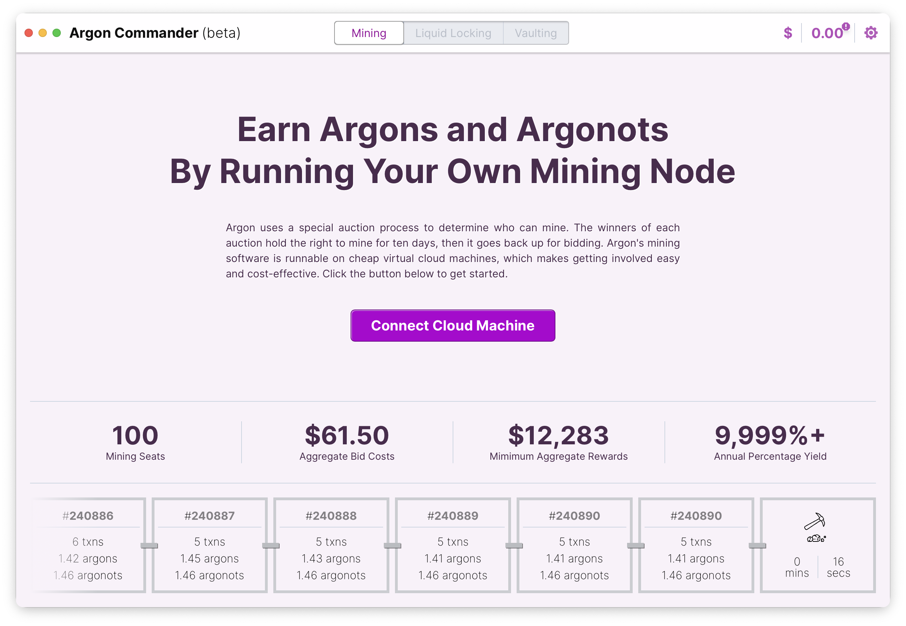

# Argon Commander

Argon Commander is a desktop application that helps you interact with the [Argon](https://argon.network) mainchain.
Among the core activities are:

- **Mining**: Argon is a proof-of-authorized-work blockchain. Use Argon Commander to mine Argon tokens.
- **Liquid Locking** Secure Bitcoins into Vaults to unlock the equivalent Argon liquidity.
- **Run a Vault** Run a vault. Earn interest by collateralizing Bitcoin Locks.



## Features

### Mining

Become an Argon Miner, even if you don't know have the technical background to manage a server.

The workflow will help you:

- Provision a cloud machine (current providers are [`Digital Ocean`, `Custom Servers`, `Local Docker`])
- Calculate a profitable "bid" amount
- Configure a bidding "bot" to win 1 or more mining seats
- Monitor your bids and earnings

### Vaults

Vaults provide collateralization security to Bitcoin Lockers. As a Vault operator, you are able to set the APR per Argon
for Bitcoin Locks, as well as the percent you're willing to share with Treasury Pool providers (for more details, refer
to the Argon documentation amd white-papers).

Activities:

- Create a Vault
- Cosign Bitcoin Lock release-requests
- Monitor Treasury Pool returns
- Liquid Lock BTC in your Vault

#### Testing Vaults
You can run the docker-compose file that's in the mainchain repository to access bitcoin liquidity to test with (locally). Run the docker per instructions in the [Argon Mainchain repository](https://github.com/argon-network/mainchain/tree/main/README.md#running-from-docker).

You will need the following commands to run against the cli locally:

```bash
# Send bitcoin to the cosign address (replace with your address/amount)
docker compose --profile tooling run --rm btc-cli sendtoaddress bcrt1qwyf38ct4yzdd4vqfwa0mtr2qw49n62y8me970737nfea3a7asmhqjcwjfc 0.00039045

# Get a destination address for released bitcoin
docker compose --profile tooling run --rm btc-cli getnewaddress

# Broadcast the released bitcoin
docker compose --profile tooling run --rm btc-cli sendrawtransaction 020000000001016aa1e38d96312ee99386a13c443bcc38e2c8cb84d55ed779d62...

# Check the status of the bitcoin transaction
docker compose --profile tooling run --rm btc-cli gettransaction 020000000001016aa1e38d96312ee99386a13c443bcc38e2c8cb84d55ed779d62...

```
## Installation

This project has an automated action to build from the source of the project for each release. The action is triggered
by a push to a `version` branch. These releases are guaranteed to match a git hash, so you can see what you're
installing. However, they are unsigned, so will require steps to open on Mac/Windows.

Downloads are available for each "release" on the [releases page](./releases/latest).

### Mac

1. Download the latest "dmg" installer from the [releases page](./releases/latest).
2. Click to run the installer once downloaded
    - Drag the `Argon Commander` app to your Applications folder
      
3. Try to open the app once (it will be blocked and prompt you to move it to the trash)
    - Click `Done`
      <br/>
      
4. Open the "System Settings" app
5. Click `Security & Privacy`
6. Navigate down to `Security`
7. Click "Open Anyway" next to the message about Argon Commander
   <br/>
   
8. Click "Open Anyway" on the pop-up
   <br/>
   
9. You can now open `Argon Commander` from the Applications folder (or a link on your Dock).

### Windows

1. Download the latest windows installer (exe or msi) from the [releases page](./releases/latest).
2. Run the installer
3. You will likely see a screen that says "Windows protected your PC"
    - Click `More info`
      <br/>
4. Click "Run Anyway"
5. Complete the installation

## Building From Source

You can build this project from source by running:

```bash
yarn install
yarn tauri build
```
